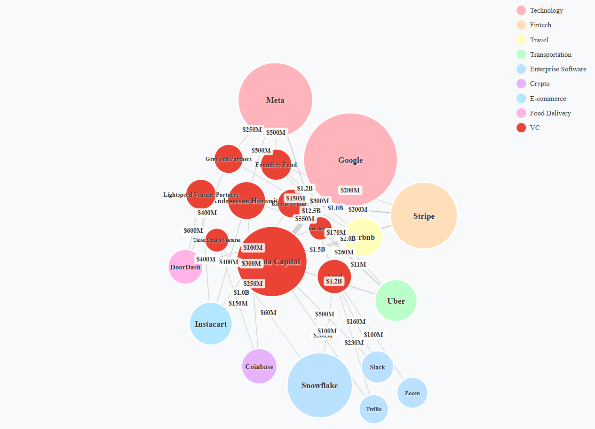

# Company Valuation Graph Visualizer



## Features

- **Bubble Chart Visualization**: Companies are displayed as bubbles with size proportional to their valuation
- **Color Coding**: Pastel colors by industry sector
- **VC Connections**: VCs are displayed in red with investment size shown on edges
- **Edge Width**: Edge width is determined by investment size
- **Interactive**: Drag bubbles, hover for tooltips
- **Responsive**: Adapts to window size
- **Force Layout**: Physics-based positioning with sector clustering

## Setup

1. Install dependencies:
   ```bash
   bun install
   ```

2. Start development server:
   ```bash
   bun run dev
   ```

3. Build for production:
   ```bash
   bun run build
   ```

## Data Source

Data is queried from `data/companies.lbdb` files via the API endpoint. The graph displays:
- Company name (inside bubble)
- Valuation (determines bubble size)
- Industry sector (determines color)

## Project Structure

```
├── src/
│   ├── main.ts          # Entry point
│   ├── graph.ts         # D3.js visualization logic
│   └── data.ts          # Data handling and color schemes
├── index.html           # HTML template
├── package.json         # Dependencies and scripts
└── tsconfig.json        # TypeScript configuration
```
